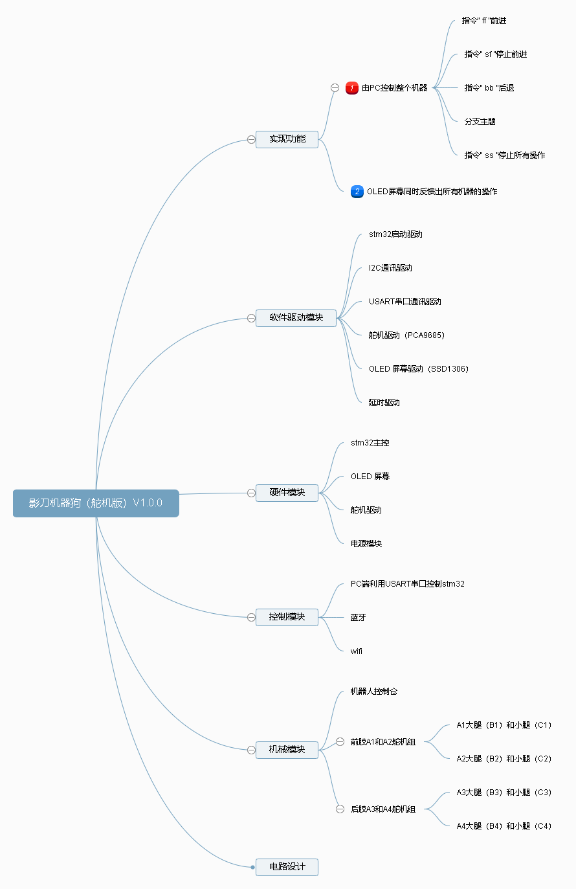

# 影刀舵机四足机器狗（舵机板）设计-----ShdowKnife-ServoVersion -QuadrupedRobot 

Author & Note ：影风远sinkfarli

Create Date ：2022.4.28

---

## Content
- [Content](#content)
- [前言](#前言)
- [Chapter 1 实现功能](#chapter-1-实现功能)
  - [1.1 PC端控制机器](#11-pc端控制机器)
  - [1.2 OLED 屏幕](#12-oled-屏幕)
- [Chaper 2 软件驱动模块](#chaper-2-软件驱动模块)
  - [2.1 stm32](#21-stm32)

---

## 前言
影刀机器狗大致思维导图：

## Chapter 1 实现功能
### 1.1 PC端控制机器
PC端利用USART串口通信对stm32发送指令控制机器。PC端操作应用：HyperTerminal

指令如下：
1. 打开串口，直接 “ 回车 ” 显示有关指令列表
2. 指令“ ff ”前进
3. 指令“ sf ”停止前进
4. 指令“ bb ”后退
5. 指令“ sb ”停止后退
6. 指令“ ss ”停止所有操作

### 1.2 OLED 屏幕
反馈当前机器的所有的人机操作界面。

## Chaper 2 软件驱动模块
所有的硬件都对应着最基本的驱动，它们是让硬件实现最基本的单一功能。

### 2.1 stm32
